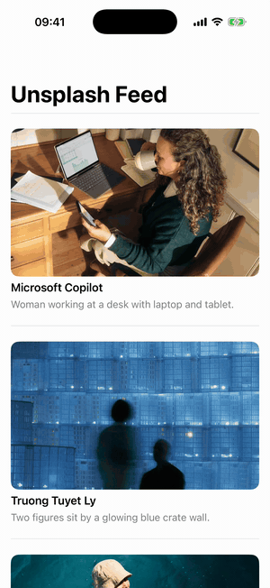

# UnsplashFeed

Load a photo feed from [Unsplash](https://unsplash.com/developers) in a few lines of Swift — and, more to the point, **see how it was built test-first (TDD)**.

[](https://github.com/A-bv/tdd-unsplash-feed/actions/workflows/ci.yml)


[](LICENSE)

<p align="center">
  
</p>

This is a teaching repo. Fetching Unsplash photos is just the vehicle; the value is the method and the clean, testable design that TDD produces.

## What you get back

`load()` returns `[UnsplashImage]`, a plain value type:

```swift
public struct UnsplashImage: Equatable {
    public let id: String
    public let description: String?   // e.g. "a misty forest at dawn"
    public let url: URL               // https://images.unsplash.com/photo-...
    public let authorName: String     // "Jane Doe"
}
```

## Install

Swift Package Manager. In Xcode, **File ▸ Add Package Dependencies…** and paste the URL:

```
https://github.com/A-bv/tdd-unsplash-feed
```

or declare it in `Package.swift`:

```swift
.package(url: "https://github.com/A-bv/tdd-unsplash-feed.git", from: "1.0.0")
```

Requires iOS 15+ / macOS 12+ (uses `async` `URLSession`). Apple platforms.

## Usage

```swift
import UnsplashFeed

let loader = UnsplashFeed.makeRemoteFeedLoader(accessKey: "YOUR_UNSPLASH_KEY")
let images = try await loader.load()

for image in images {
    print(image.authorName, image.url)
}
```

In a SwiftUI list:

```swift
struct FeedView: View {
    @State private var images: [UnsplashImage] = []
    let loader = UnsplashFeed.makeRemoteFeedLoader(accessKey: "YOUR_UNSPLASH_KEY")

    var body: some View {
        List(images, id: \.id) { image in
            Text(image.authorName)
        }
        .task { images = (try? await loader.load()) ?? [] }
    }
}
```

A free [Unsplash access key](https://unsplash.com/oauth/applications) (about a minute to get) is needed only to fetch real photos — **not** to build or test.

## How it was built with TDD

Every line of the loader was driven by a failing test first. One concrete example — *"a network failure should surface as a `connectivity` error, not leak the raw error"*:

**🔴 Red** — write the test; it fails because the behaviour doesn't exist yet:

```swift
func test_load_deliversConnectivityErrorOnClientError() async {
    let (sut, client) = makeSUT()
    client.stub(error: anyNSError())          // the network throws

    await assertThrows(RemoteFeedLoader.Error.connectivity) {
        _ = try await sut.load()
    }
}
```

**🟢 Green** — add the least code to pass it:

```swift
do {
    (data, response) = try await client.get(from: url)
} catch {
    throw Error.connectivity
}
```

**🔵 Refactor** — tidy the design while the tests stay green (later, JSON parsing was pulled out into its own `UnsplashImageMapper`).

To watch the **whole** feature grow this way, read the commits from the start:

```bash
git log --oneline --reverse
```

Each commit is one Red→Green→Refactor step. Only the last two — this README and CI — are marked **non-TDD**.

## The design TDD produced

Writing tests first forced clean seams:

- **`FeedLoader` and `HTTPClient` are protocols** — the loader is tested against an in-memory stub, so no real requests happen in unit tests.
- **One place touches the network** (`URLSessionHTTPClient`); **one place parses JSON** (`UnsplashImageMapper`).
- **Typed errors** (`.connectivity`, `.invalidData`) instead of leaking raw `NSError`.

## Tests

```bash
swift test
```

16 tests, fully offline: the network is faked with a `URLProtocol`/spy stub, so no key or internet is needed.

## License

MIT. See [LICENSE](LICENSE).
