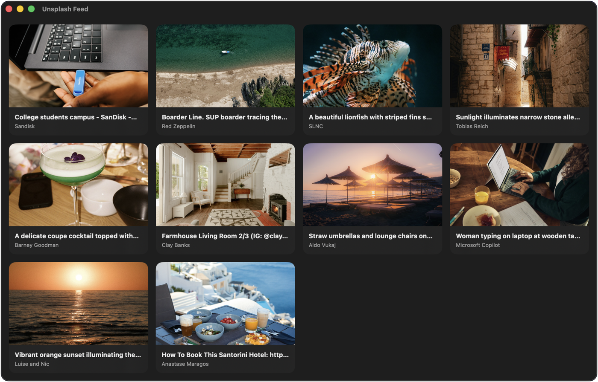

# Fetching images from Unsplash using TDD

A small Swift package that loads a photo feed from the [Unsplash API](https://unsplash.com/developers), built test-first.

[](https://github.com/A-bv/tdd-unsplash-feed/actions/workflows/ci.yml)


[](LICENSE)

<table align="center">
  <tr>
    <td align="center"></td>
    <td align="center"></td>
  </tr>
  <tr>
    <td align="center"><sub><em>iOS, a scrolling feed</em></sub></td>
    <td align="center"><sub><em>macOS, a grid gallery</em></sub></td>
  </tr>
</table>

## Install

Swift Package Manager:

In Xcode, File ▸ Add Package Dependencies… and paste the URL:

```
https://github.com/A-bv/tdd-unsplash-feed
```

## Usage

Register your app at [unsplash.com/oauth/applications](https://unsplash.com/oauth/applications) to get a free Access Key. Then create a loader and show the photos.

```swift
import SwiftUI
import UnsplashFeed

struct FeedView: View {
    @State private var images: [UnsplashImage] = []
    let loader = UnsplashFeed.makeRemoteFeedLoader(accessKey: "YOUR_ACCESS_KEY")

    var body: some View {
        List(images, id: \.id) { image in
            AsyncImage(url: image.url) { $0.resizable().scaledToFill() } placeholder: { ProgressView() }
                .frame(height: 200)
        }
        .task { images = (try? await loader.load()) ?? [] }
    }
}
```

Not using SwiftUI? The call is the same everywhere. Make a loader once, then:

```swift
let images = try await loader.load()   // [UnsplashImage], each with a url and an authorName
```

## What it handles

Each of these is locked in by a test. In plain words:

- **It waits until you ask.** Just creating the loader never calls the internet. It fetches only when you call `load()`.
- **A dead connection is clear.** If the network fails, you get a simple connection error, not a raw system message.
- **A bad answer is caught.** A web server replies with a status code, and 200 means OK. If the answer is anything else, like 404 or 500, the loader stops and reports the data as invalid.
- **A good answer becomes photos.** On a 200 OK, the loader reads the returned data and turns it into a list of images.

## How it was built with TDD

TDD (Test-Driven Development) means building the code in tiny steps. Each step is the same three-part cycle.

1. Red. Write one small test for a behavior you do not have yet. Run it. It fails, because the code is not there.
2. Green. Write the least code that makes the test pass. Run it. It passes.
3. Refactor. Clean up what you just wrote, while the tests stay green.

Then you repeat for the next behavior. Nothing is written unless a test asked for it.

Here is one cycle, for the behavior "a network failure should become a connectivity error".

Red, the failing test:

```swift
func test_load_deliversConnectivityErrorOnClientError() async {
    let (sut, client) = makeSUT()
    client.stub(error: anyNSError())

    await assertThrows(RemoteFeedLoader.Error.connectivity) {
        _ = try await sut.load()
    }
}
```

In that test, `makeSUT` builds the loader with a fake network client, `stub(error:)` tells the fake to fail, and `assertThrows` checks the loader turns the failure into a `connectivity` error.

Green, the code that makes it pass:

```swift
do {
    _ = try await client.get(from: url)
} catch {
    throw Error.connectivity
}
```

Refactor happens later, once a few behaviors exist, for example moving the JSON parsing into its own type.

## See it in the commits

The whole feature was built this way. Read the [commit history](https://github.com/A-bv/tdd-unsplash-feed/commits/main) from the bottom up and the cycle repeats:

- 🔴 a test commit, the failing test plus any fake it needs to run, like a spy or a stub
- 🟢 a feat commit that adds only the production code that makes it pass
- 🔵 a refactor commit that tidies up

## Tests

Run `swift test`. The 16 tests are fully offline. The network is faked with a stub, so no key or internet is needed.

## License

MIT. See [LICENSE](LICENSE).

<sub>Unofficial. Not affiliated with or endorsed by Unsplash.</sub>
