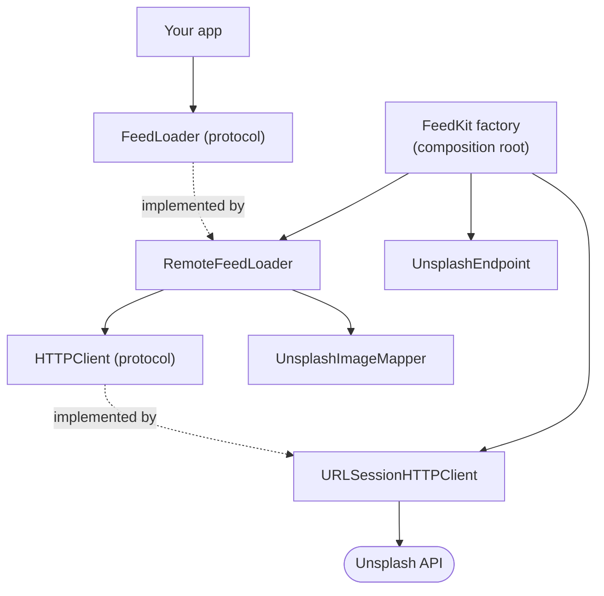

# FeedKit

[](https://github.com/A-bv/Feedkit/actions/workflows/ci.yml)

A small Swift package that loads an image feed from the [Unsplash API](https://unsplash.com/developers) — built **strictly with Test-Driven Development (TDD)** as a learning exercise.

The point of this repo is less the feature itself and more the **method**: every line of production code exists because a failing test demanded it, following the **Red → Green → Refactor** cycle.

## Quickstart

1. **Get a free Unsplash key** — register an app at [unsplash.com/oauth/applications](https://unsplash.com/oauth/applications) and copy the *Access Key* (about a minute).
2. **Add the package** in your `Package.swift`:
   ```swift
   .package(url: "https://github.com/A-bv/Feedkit.git", from: "1.0.0")
   ```
3. **Load the feed:**
   ```swift
   import FeedKit

   let loader = FeedKit.makeRemoteFeedLoader(accessKey: "YOUR_ACCESS_KEY")
   let images = try await loader.load()   // [UnsplashImage]
   ```

No key is needed to build or test the package itself — the suite runs fully offline.

## Why this project exists

It's a hands-on demonstration of the TDD workflow popularised by [Essential Developer](https://www.essentialdeveloper.com/):

1. **🔴 Red** — write a failing test describing one desired behaviour.
2. **🟢 Green** — write the minimum production code to make it pass.
3. **🔵 Refactor** — clean up the design while the tests stay green.

The result is a decoupled, fully tested networking feature with zero test code leaking into the shipped library.

**Read it through its commits.** Every behaviour was added as a failing test plus the minimum code to pass it, so the history *is* the design. Browse the [commit history](https://github.com/A-bv/Feedkit/commits/main) or the step-by-step [TDD walkthrough](TDD-WALKTHROUGH.md).

## Architecture

The package is organised by feature concern, depending on abstractions rather than concretions:



The full layout:

```
Sources/FeedKit
├── Feed Feature/              # The domain — no networking knowledge
│   ├── UnsplashImage.swift    #   Value-type model (value equality)
│   └── FeedLoader.swift       #   `load() async throws -> [UnsplashImage]`
├── Feed API/                  # The networking layer
│   ├── HTTPClient.swift       #   Abstraction over the network
│   ├── RemoteFeedLoader.swift #   FeedLoader over HTTP (typed errors)
│   ├── UnsplashImageMapper.swift  # Maps Unsplash JSON -> domain model
│   ├── URLSessionHTTPClient.swift # The only place touching the real network
│   └── UnsplashEndpoint.swift #   Builds Unsplash URLs (client_id auth)
└── FeedKit.swift              # Composition root / factory
```

Key design decisions:

- **`FeedLoader` is a protocol.** Callers depend on the behaviour, not the source — making it trivial to swap in a `RemoteFeedLoader`, a future cache, or a test double.
- **`HTTPClient` is a protocol.** `RemoteFeedLoader` is tested entirely against an in-memory spy; no real requests are made in unit tests.
- **Typed errors.** `RemoteFeedLoader.Error` distinguishes `.connectivity` from `.invalidData` instead of leaking `NSError`.
- **Value semantics.** `UnsplashImage` compares by its fields, not by an identity token.

## Usage

```swift
import FeedKit

// Composition root wires URLSession + endpoint + loader together.
let loader = FeedKit.makeRemoteFeedLoader(accessKey: "YOUR_UNSPLASH_ACCESS_KEY")

do {
    let images: [UnsplashImage] = try await loader.load()
    for image in images {
        print(image.authorName, image.url)
    }
} catch RemoteFeedLoader.Error.connectivity {
    print("No connection")
} catch RemoteFeedLoader.Error.invalidData {
    print("Server returned an unexpected response")
}
```

Get a free access key by registering an app at <https://unsplash.com/oauth/applications>.

## Installation

Add the package in `Package.swift`:

```swift
dependencies: [
    .package(url: "https://github.com/A-bv/Feedkit.git", from: "1.0.0")
]
```

Requires **Swift 5.9+**. It's pure Foundation (no UIKit), so it runs on macOS 12+, iOS 15+, tvOS 15+, watchOS 8+, and Linux. macOS and Linux are exercised in CI.

## Running the tests

```bash
swift test
```

The suite covers the loader's full contract (request URL, connectivity failure, non-200 responses, invalid JSON, empty and populated feeds), the real `URLSession` client (via a `URLProtocol` stub, no live network), and the endpoint builder.

Continuous integration runs `swift build` + `swift test` on every push and pull request (see [`.github/workflows/ci.yml`](.github/workflows/ci.yml)).

## License

Released under the [MIT License](LICENSE).
